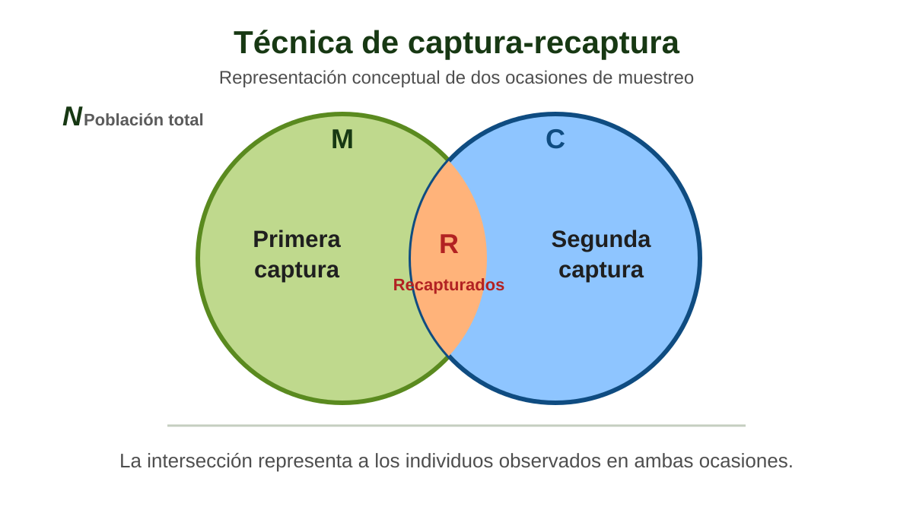

## Ruta de la práctica

::::::::::::::: {.brand-grid .four}
::::: {.brand-card .green}
::: card-number
01
:::

::: card-title
Problema
:::

<p>Inferir el tamaño de una población que no podemos contar por
completo.</p>
:::::

::::: {.brand-card .blue}
::: card-number
02
:::

::: card-title
Estimador
:::

<p>Derivar Lincoln–Petersen y comprender qué representa.</p>
:::::

::::: {.brand-card .green}
::: card-number
03
:::

::: card-title
Incertidumbre
:::

<p>Aplicar Chapman, varianza e intervalo de confianza.</p>
:::::

::::: {.brand-card .blue}
::: card-number
04
:::

::: card-title
Programación
:::

<p>Convertir el procedimiento en una función validada en R.</p>
:::::
:::::::::::::::

------------------------------------------------------------------------

## El problema ecológico {.section-slide .no-underline}

::: section-subtitle
La **abundancia** es una **propiedad** de la **población**; la
**captura** sólo observa una **fracción**.
:::

------------------------------------------------------------------------

## ¿Cómo estimar una población que no podemos censar?

::::::::: {.brand-grid .three}
:::: {.brand-card .green}
::: card-title
Primera ocasión
:::

<p>Capturamos, marcamos y liberamos individuos.</p>
::::

:::: {.brand-card .blue}
::: card-title
Mezcla
:::

<p>Los marcados vuelven a integrarse a la población.</p>
::::

:::: {.brand-card .green}
::: card-title
Segunda ocasión
:::

<p>Capturamos nuevamente y contamos cuántos están marcados.</p>
::::
:::::::::

::: brand-note
La información clave no es sólo cuántos capturamos, sino <strong>qué
proporción de la segunda muestra ya estaba marcada</strong>.
:::

------------------------------------------------------------------------

## Notación mínima: M, C y R

:::::::::::: {.brand-grid .three}
::::: {.brand-card .green}
::: big-number
Marcados
:::

::: card-title
:::

<p>Individuos marcados y liberados en la **primera ocasión**.</p>
:::::

::::: {.brand-card .blue}
::: {.big-number .science-blue}
Capturados
:::

::: card-title
:::

<p>Total de individuos capturados en la **segunda ocasión**.</p>
:::::

::::: {.brand-card .green}
::: big-number
Recapturados
:::

::: card-title
:::

<p>Individuos de la segunda muestra que **conservan la marca**.</p>
:::::
::::::::::::

<div style="text-align:center; margin-top: 0.6rem;">
  
</div>

------------------------------------------------------------------------

## Esquema

<div style="text-align:center; margin-top: 0.1rem;">
  
</div>

------------------------------------------------------------------------

## La idea proporcional

Si la **segunda muestra** es **representativa** de la población, la **fracción de individuos marcados** en esa muestra aproxima la **fracción marcada en toda la población**.

::: columns

::: {.column width="48%"}

### Proporción observada

::: equation-panel

$$
\frac{R}{C} \approx \frac{M}{N}
$$

:::

La proporción de **recapturados** (R) en la **segunda muestra** (C) representa aproximadamente la proporción de individuos **marcados** (M) en toda la **población** (N).

:::

::: {.column width="48%"}

### Estimador resultante

::: equation-panel

$$
\hat{N}_{LP}=\frac{M\,C}{R}
$$

:::

A partir de la proporción observada obtenemos el estimador de **Lincoln–Petersen** para el tamaño de la población.

:::

:::
------------------------------------------------------------------------

## Un ejemplo de cálculo

Supongamos:

[M = 50]{.pill} [C = 60]{.pill .blue} [R = 15]{.pill}

::: equation-panel

$$\hat{N}_{LP}=\frac{50\times 60}{15}=200$$
:::

::: brand-note
Interpretación: bajo los supuestos del modelo, estimamos una población
de aproximadamente <strong>200 individuos</strong>.
:::

------------------------------------------------------------------------

## Sesgo e incertidumbre {.section-slide .no-underline}

::: section-subtitle
Una estimación puntual no describe por sí sola cuánto sabemos sobre la
población.
:::

------------------------------------------------------------------------

## ¿Por qué usar la corrección de Chapman?

El estimador de Lincoln–Petersen puede presentar sesgo cuando el número
de recapturas es pequeño.

::: equation-panel

$$\hat{N}_{Chapman}=\frac{(M+1)(C+1)}{R+1}-1$$
:::

Para el mismo escenario:

$$\hat{N}_{Chapman}=\frac{(50+1)(60+1)}{15+1}-1\approx 193.44$$

::: brand-note
Chapman no “corrige todos los problemas” del diseño; reduce el sesgo del
estimador bajo el mismo conjunto de supuestos.
:::

------------------------------------------------------------------------

## La incertidumbre también debe estimarse

Una aproximación habitual para la varianza de Chapman es:

::: equation-panel

$$\operatorname{Var}(\hat{N})=
\frac{(M+1)(C+1)(M-R)(C-R)}{(R+1)^2(R+2)}$$
:::

Luego:

$$SE=\sqrt{\operatorname{Var}(\hat{N})}$$

$$IC_{95\%}\approx \hat{N}_{Chapman}\pm 1.96\,SE$$

::: small-source
En aplicaciones reales, la elección del intervalo debe considerar tamaño
de muestra, comportamiento del estimador y estructura del estudio.
:::

------------------------------------------------------------------------

## Pocas recapturas = mucha incertidumbre

::::::: columns
:::: {.column width="48%"}
### Escenario A

[M = 50]{.pill} [C = 60]{.pill .blue} [R = 15]{.pill}

Recapturas relativamente frecuentes.

::: compare-b
Estimación más estable.
:::
::::

:::: {.column width="48%"}
### Escenario B

[M = 50]{.pill} [C = 60]{.pill .blue} [R = 3]{.pill .red}

Muy pocos marcados reaparecen.

::: compare-a
Estimación grande e imprecisa.
:::
::::
:::::::

::: {.brand-note .red}
Cuando <strong>R disminuye</strong>, el **denominador** se vuelve pequeño y
la estimación responde de forma muy sensible a cada recaptura.
:::

------------------------------------------------------------------------

## Sensibilidad del estimador a Recapturas

::: columns

::: {.column width="36%"}

### Relación clave

Manteniendo **M = 50 y C = 60  constantes**:

::: equation-panel

$$
\hat{N}_{LP}=\frac{M\,C}{R}
$$

:::

### $R \downarrow \quad \Rightarrow \quad \hat{N}_{LP} \uparrow$

**Menos recapturas sugieren una población mayor**, pero también hacen que la estimación de $\hat{N}_{LP}$ sea más **incierta**.

:::

::: {.column width="64%"}

```{r}
#| echo: false
#| warning: false
#| message: false
#| fig-width: 8
#| fig-height: 4.6
#| fig-align: center
#| out-width: "100%"

sensibilidad_R <- tibble::tibble(
  R = c(2, 5, 10, 15, 20),
  N_LP = c(1500, 600, 300, 200, 150)
)

library(ggplot2)

ggplot(
  sensibilidad_R,
  aes(x = R, y = N_LP)
) +
  geom_line(
    linewidth = 1.4,
    color = "#5A6E36"
  ) +
  geom_point(
    size = 4.2,
    color = "#123A5A"
  ) +
  geom_text(
    aes(label = N_LP),
    vjust = -0.7,
    size = 4.5,
    fontface = "bold",
    color = "#1A3D14"
  ) +
  scale_x_continuous(
    breaks = c(2, 5, 10, 15, 20)
  ) +
  scale_y_continuous(
    limits = c(0, 1700),
    breaks = c(0, 400, 800, 1200, 1600),
    labels = scales::label_number(),
    expand = expansion(mult = c(0, 0.02))
  ) +
  labs(
    x = "Individuos recapturados (R)",
    y = "Abundancia estimada (N̂LP)"
  ) +
  theme_minimal(base_size = 14) +
  theme(
    panel.grid.minor = element_blank(),
    panel.grid.major.x = element_blank(),
    axis.title = element_text(
      face = "bold",
      color = "#5B5B5B"
    ),
    axis.text = element_text(
      color = "#5B5B5B"
    ),
    plot.margin = margin(
      t = 12,
      r = 15,
      b = 8,
      l = 8
    )
  )
```

:::

:::

------------------------------------------------------------------------

## Supuestos del modelo {.section-slide .no-underline}

::: section-subtitle
La ecuación es sencilla; la validez de la inferencia depende de que el
proceso biológico sea compatible con sus supuestos.
:::

------------------------------------------------------------------------

## Cuatro supuestos fundamentales

::::::::::::::: {.brand-grid .four}
::::: {.brand-card .green}
::: card-number
01
:::

::: card-title
Población cerrada
:::

<p>Sin nacimientos, muertes, inmigración o emigración relevantes entre
ocasiones.</p>
:::::

::::: {.brand-card .blue}
::: card-number
02
:::

::: card-title
Marcas persistentes
:::

<p>La marca no se pierde y se reconoce correctamente.</p>
:::::

::::: {.brand-card .green}
::: card-number
03
:::

::: card-title
Capturabilidad comparable
:::

<p>Los individuos tienen probabilidades de captura suficientemente
semejantes.</p>
:::::

::::: {.brand-card .blue}
::: card-number
04
:::

::: card-title
Marca neutral
:::

<p>Marcar no modifica supervivencia ni probabilidad de recaptura.</p>
:::::
:::::::::::::::

------------------------------------------------------------------------

## ¿Qué ocurre si un supuesto falla?

| Violación | Consecuencia potencial |
|------------------------------------|------------------------------------|
| Marcados evitan las trampas | R disminuye → N puede sobreestimarse |
| Marcados son atraídos a las trampas | R aumenta → N puede subestimarse |
| Emigración de marcados | R disminuye → apariencia de una población mayor |
| Pérdida de marcas | recapturados se cuentan como no marcados |
| Mortalidad asociada al marcado | altera la fracción marcada disponible |

::: {.brand-note .red}
La dirección del sesgo depende del mecanismo. Antes de “corregir” una
cifra debemos identificar qué proceso generó la violación.
:::

------------------------------------------------------------------------

## La escala temporal define qué significa “cerrada”

::::::::: {.brand-grid .three}
:::: {.brand-card .green}
::: card-title
Horas / días
:::

<p>Puede ser razonable para algunas poblaciones y métodos.</p>
::::

:::: {.brand-card .blue}
::: card-title
Semanas
:::

<p>Aumenta el riesgo de movimiento, mortalidad o reclutamiento.</p>
::::

:::: {.brand-card .red}
::: card-title
Meses
:::

<p>La hipótesis de cierre suele requerir una justificación mucho más fuerte.</p>
::::
:::::::::

::: brand-note
**“Población cerrada”** no significa inmóvil: *significa que los cambios entre ocasiones son despreciables para la inferencia propuesta.*
:::

------------------------------------------------------------------------

## Del estimador a una función en R {.section-slide .no-underline}

::: section-subtitle
Programar el método obliga a declarar entradas, validar restricciones y
definir exactamente qué resultados devuelve.
:::

------------------------------------------------------------------------

## Diseñar la función antes de escribirla

::::::::: {.brand-grid .three}
:::: {.brand-card .green}
::: card-title
Entradas
:::

<p><code>M</code>, <code>C</code>, <code>R</code>, nivel de
confianza.</p>
::::

:::: {.brand-card .blue}
::: card-title
Validaciones
:::

<p>R \> 0, valores no negativos y R ≤ min(M, C).</p>
::::

:::: {.brand-card .green}
::: card-title
Salidas
:::

<p>LP, Chapman, varianza, SE e intervalo.</p>
::::
:::::::::

``` r
estimador_lp <- function(M, C, R, nivel = 0.95) {
  # validar entradas
  # calcular estimadores
  # calcular incertidumbre
  # devolver resultados
}
```

------------------------------------------------------------------------

## Validar es comparar resultados independientes

:::::::::::: {.brand-grid .three}
::::: {.brand-card .green}
::: card-number
1
:::

::: card-title
Cálculo manual
:::

<p>Resolver el escenario A paso por paso.</p>
:::::

::::: {.brand-card .blue}
::: card-number
2
:::

::: card-title
Función
:::

<p>Ejecutar exactamente los mismos M, C y R.</p>
:::::

::::: {.brand-card .green}
::: card-number
3
:::

::: card-title
Contraste
:::

<p>Verificar que ambos resultados coincidan dentro de la precisión
numérica.</p>
:::::
::::::::::::

::: {.brand-note .dashed}
<strong>Programar no reemplaza comprender el modelo.</strong> La
validación conecta la fórmula, el código y la interpretación biológica.
:::

------------------------------------------------------------------------

## Del fundamento al laboratorio {.no-underline}

::: kicker
Ahora en RStudio
:::

::: section-title
<code>scripts/03_lab-lincoln-petersen.R</code>
:::

::: {.brand-note .blue}
Construiremos el estimador paso a paso, lo convertiremos en una función,
compararemos escenarios y evaluaremos su sensibilidad a las recapturas.
:::

::: small-source
Métodos clásicos de captura–recaptura de dos ocasiones: Lincoln–Petersen
y corrección de Chapman.
:::
