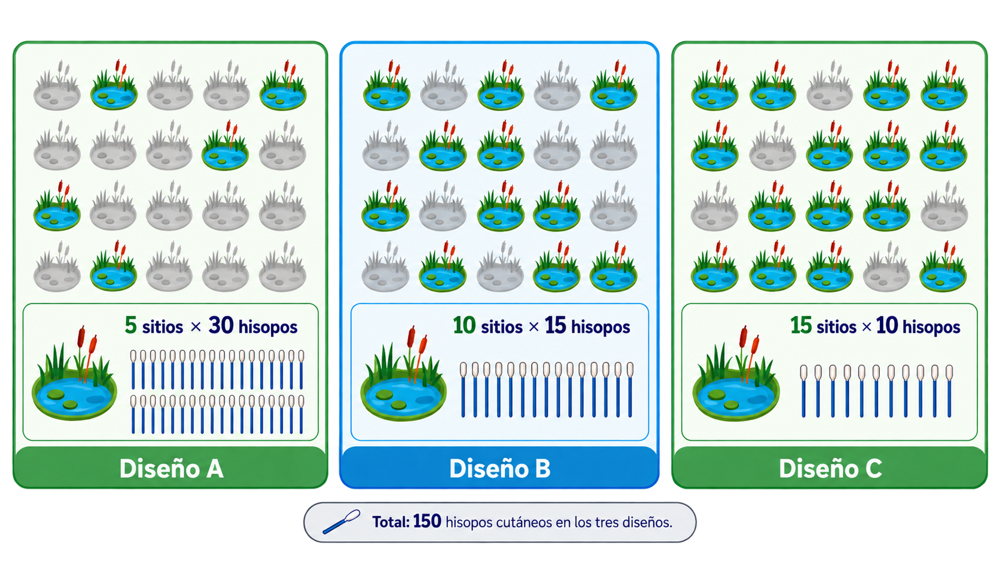

## Ruta del script

::::::::::::::: {.brand-grid .four}
::::: {.brand-card .green}
::: card-number
01
:::

::: card-title
Detectar
:::

<p>*¿Cuántas muestras necesito para encontrar al menos un positivo?*</p>
:::::

::::: {.brand-card .blue}
::: card-number
02
:::

::: card-title
Estimar
:::

<p>*¿Cuántas necesito para estimar prevalencia con precisión?*</p>
:::::

::::: {.brand-card .green}
::: card-number
03
:::

::: card-title
Comparar
:::

<p>*¿Cuántas necesito para detectar diferencias entre grupos?*</p>
:::::

::::: {.brand-card .blue}
::: card-number
04
:::

::: card-title
Seleccionar
:::

<p>Una vez definido **n**: *¿qué unidades entrarán realmente en la muestra?*</p>
:::::
:::::::::::::::


::: {style="text-align:center; margin-top: 0.6rem;"}
```{=html}

```
:::

------------------------------------------------------------------------

## El cálculo empieza antes que R

::: {.brand-note style="text-align:center;margin-bottom: 1.5rem;"}
<strong>El tamaño de muestra es una consecuencia del objetivo inferencial.</strong> 
<br>Un <strong>"n"</strong> grande no corrige por sí mismo sesgo, pseudorreplicación ni mala selección.
:::

<div style="text-align:center; margin: 0.8rem 0 2rem 0;">
<p><em>Por ello, antes de calcular <strong>n</strong>, debemos definir qué queremos demostrar con la muestra: <br><strong>detectar</strong> presencia, <strong>estimar</strong> una prevalencia o <strong>comparar</strong> grupos.</em></p>
</div>


::::::::: {.brand-grid .three}
:::: {.brand-card .green}
::: card-title
Presencia
:::

<p>Maximizar la **probabilidad** de observar ≥1 positivo.</p>
::::

:::: {.brand-card .blue}
::: card-title
Prevalencia
:::

<p>Controlar la **incertidumbre** alrededor de una proporción.</p>
::::

:::: {.brand-card .green}
::: card-title
Comparación
:::

<p>Alcanzar **potencia** suficiente para identificar una diferencia.</p>
::::
:::::::::

<div style="text-align:center;">
<em>“La pregunta cambia el criterio de cálculo”</em>
</div>

------------------------------------------------------------------------

## Detección de presencia {.section-slide .no-underline}

::: section-subtitle
Del supuesto de **prevalencia** a una **probabilidad** explícita de **detección**.
:::

------------------------------------------------------------------------

## Antes de calcular

En un estudio orientado a **detectar la presencia** de un patógeno, normalmente desconocemos la **prevalencia real** de la población antes de muestrear. Por lo tanto, para el **diseño del muestreo** establecemos una: 

::: equation-panel 
$$ 
p = \text{prevalencia mínima de diseño} 
$$
:::

<div class="brand-grid three"> 
<div class="brand-card green"> 
<div class="card-title">No es</div> 
<p>La <strong>prevalencia real</strong> de la población, porque todavía no la conocemos.</p> 
</div> 

<div class="brand-card blue"> 
<div class="card-title">Sí es</div> 
<p>Un valor definido <em><strong>a priori</strong></em> para planificar el esfuerzo de muestreo.</p> 
</div> 

<div class="brand-card green"> 
<div class="card-title">Determina</div> 
<p>Cuántas unidades necesitamos examinar para alcanzar una <strong>probabilidad de detección</strong> determinada.</p> </div> 
</div>

::: brand-note
<strong>Ejemplo:</strong> elegir **$p=0.10$** significa diseñar el estudio para tener una alta probabilidad de **detectar al patógeno** si está presente en al menos el **10%** de la población.
:::

------------------------------------------------------------------------

## Fundamentos para la detección

Si la **prevalencia mínima de diseño** es **$p$**, entonces la **probabilidad** de que **una muestra** seleccionada sea **negativa** es:

$$ 
1-p 
$$ 

Por regla de **independencia** —*es decir, que el resultado de una muestra no afecta al de otra*— la probabilidad de que **todas las muestras resulten negativas** se expresa como:

$$ 
(1-p)\times(1-p)\times\cdots\times(1-p) \qquad (n\ \text{veces}) 
$$ 

Lo cual se simplifica en: 
$$ 
(1-p)^n 
$$

::: {.brand-note style="text-align:center;margin-bottom: 1.5rem;"}
<em>Elevar a la **$n$** significa que la misma **probabilidad de fallo** se **repite** en **cada intento independiente**.</em>
:::

------------------------------------------------------------------------

## Probabilidad de detección

El supuesto de **independencia** $(1-p)^n$ nos permite determinar la **probabilidad de no detectar** al agente patógeno en una muestra, en función de un nivel de **prevalencia de diseño**.

<div style="text-align:center; margin: 2rem 2rem 2rem 0;">
<em><strong>Ejemplo:</strong> Con una prevalencia de diseño del 30% ($p = 0.30$) y 3 individuos examinados ($n = 3$)</em>
</div>

::: equation-panel
$$
P(\text{no detectar})=(1-p)^n = (1-0.30)^3 = 0.343
$$
:::

Tenemos un **34.3%** de probabilidad de **no detectar** al agente patógeno. 

<div style="text-align:center; margin: 2rem 2rem 2rem 0;">
<em>Por el principio de <strong>complementariedad</strong>, la probabilidad de <strong>detectar al menos un positivo</strong> es:</em>
</div>

::: equation-panel
$$
P(\text{al menos un positivo}) = 1-P(\text{no detectar}) = (1-0.343) = 0.657
$$
:::

Por lo tanto, tenemos un **65.7%** de probabilidad de **detectar** al menos **un positivo**.

------------------------------------------------------------------------

## De probabilidad de detección a tamaño de muestra 

Hasta ahora hemos respondido esta pregunta:

::: equation-panel 
$$ 
\text{Si conozco } p \text{ y } n,\quad \text{¿cuál es mi probabilidad de detectar al menos un positivo?} 
$$
:::

Pero en el diseño de muestreo normalmente necesitamos resolver el problema al revés:

::: {.brand-note style="text-align:center;margin-bottom: 1.5rem;"}
¿Cuántas muestras debo examinar para alcanzar una <strong>probabilidad de detección</strong> previamente definida?
:::

Si queremos que la **probabilidad de detectar** al menos **un positivo** sea igual a un **nivel de confianza** **$(NC)$** deseado, entonces establecemos lo siguiente:

::: equation-panel
$$ P(\text{al menos un positivo}) = 1-P(\text{no detectar}) = NC $$ 
:::

<div style="text-align:center; margin-top:1.2rem;"> 
<em>
Ahora conocemos <strong>**$p$**</strong> y fijamos <strong>**$NC$**</strong> y la incógnita pasa a ser <strong>**$n$**</strong>: el número de muestras necesarias.
</em>
</div> 

------------------------------------------------------------------------

## Despejando la incógnita "**$n$**"

Sabemos que la probabilidd de **no detectar ningún positivo** en **$n$** muestras **independientes** es **$(1-p)^n$**.

Si queremos una **probabilidad de detección igual** a un **nivel de confianza** **$(NC)$**, entonces, por **complementariedad**, la probabilidad de **no detectar ningún positivo** debe ser igual a **$1-NC$** 

Por lo tanto:

::: equation-panel
$$
(1-p)^n = 1 - NC
$$
:::

Para encontrar el **tamaño de muestra** **$n$**, aplicamos **logaritmo natural** $(ln)$ a ambos lados y utilizamos la propiedad $\ln(a^n)=n\ln(a)$:

::: equation-panel
$$
n\ln(1-p) = ln(1 - NC)
$$
:::

<div style="text-align:center; margin:1.2rem 0;"> 
<em>El logaritmo natural <strong>(ln)</strong> aparece porque es la <strong>herramienta matemática</strong> para <strong>“despejar”</strong> el exponente <strong>n</strong> cuando trabajamos con potencias</em>
</div>

------------------------------------------------------------------------

## Detectar con Nivel de Confianza

Así, para un **nivel de confianza** **($NC$)** deseado del **95%** y una **prevalencia de diseño** **($p$)** del **30%**, el tamaño de muestra **($n$)** se calcula aplicando:

::: equation-panel
$$n=\frac{\ln(1-NC)}{\ln(1-p)} = \frac{\ln(1-0.95)}{\ln(1-0.30)} = \frac{\ln(0.05)}{\ln(0.70)} \approx 8.399$$
:::

Donde $p=0.30$ y $NC=0.95$

Como el tamaño de muestra debe expresarse en unidades completas, el resultado se redondea hacia arriba:

::: {.brand-note style="text-align:center;margin-bottom: 1.5rem;"}
<strong>$n = 9$ individuos</strong>
:::

**La interpretación es la siguiente**: *Con una prevalencia mínima de diseño de $0.30$ y un nivel de confianza del $0.95$, necesitamos examinar al menos **9 individuos** para alcanzar una **probabilidad de detección** de por lo menos el **95%**, bajo los **supuestos del modelo**.*

------------------------------------------------------------------------

## Supuestos del modelo

Para que la fórmula de detección sea válida, debemos asumir:

<div class="brand-grid four">

<div class="brand-card green">
<div class="card-title">Detección perfecta</div>
<p>Si un individuo está infectado, lo detectamos. Se asume ausencia de errores de clasificación: <br><strong>\(Se = Sp = 1\)</strong>.</p>
</div>

<div class="brand-card blue">
<div class="card-title">Independencia</div>
<p>El estado o resultado de una unidad <strong>no modifica</strong> el de las demás.</p>
</div>

<div class="brand-card green">
<div class="card-title">Probabilidad constante</div>
<p>Cada unidad tiene la misma probabilidad <strong>\(p\)</strong> de estar infectada.</p>
</div>

<div class="brand-card blue">
<div class="card-title">Muestreo representativo</div>
<p>Las unidades examinadas representan razonablemente a la <strong>población objetivo</strong>.</p>
</div>
</div>

------------------------------------------------------------------------

## La sensibilidad modifica el esfuerzo

Sin embargo, **una prueba** puede **no detectar** a todos los **individuos infectados**. Si mantenemos una **prevalencia de diseño** del **10%** **$(p=0.10)$** y un **nivel de confianza** del **95%** **$(NC=0.95)$**, podemos comparar dos escenarios:

::::::: {.brand-grid .two}

:::: {.brand-card .green}

::: card-title
Prueba perfecta: $Se=1$
:::

::::: {style="font-size:18px;"}

La probabilidad de detección por unidad coincide con la prevalencia de diseño:

::: equation-panel
$$
p_{\text{efectiva}} = p
$$
:::

Por tanto, la probabilidad de **no detectar ningún positivo** es:

::: equation-panel
$$
P(\text{no detectar})=(1-p)^n
$$
:::

:::::

::::


:::: {.brand-card .blue}

::: card-title
Prueba imperfecta: $Se<1$
:::

::::: {style="font-size:18px;"}

La probabilidad de detección por unidad disminuye según la sensibilidad:

::: equation-panel
$$
p_{\text{efectiva}} \approx p\times Se
$$
:::

Por tanto, la probabilidad de **no detectar ningún positivo** pasa a ser:

::: equation-panel
$$
P(\text{no detectar})=(1-p_{\text{efectiva}})^n
$$
:::

:::::

::::

:::::::

------------------------------------------------------------------------

## Efecto de la sensibilidad en "$n$"

<div style="text-align:center; margin:1.5rem 0;">
<em>Al disminuir la **sensibilidad** **$(Se)$**, disminuye la **probabilidad efectiva** de **detectar** una unidad positiva y **aumenta** el **tamaño de muestra** necesario.</em>
</div>

Al sustituir cada **parámetro** en el escenario correspondiente, **estimamos** distintos **tamaños de muestra** **($n$)**: 

::::::: {.brand-grid .two}

:::: {.brand-card .green}

::: card-title
Con $Se=1$
:::

::::: {style="font-size:18px;"}

::: equation-panel
$$
n=\frac{\ln(1-NC)}{\ln(1-p)}
=
\frac{\ln(1-0.95)}{\ln(1-0.10)}
\approx 28.43
$$
:::

<p style="text-align:center;"><strong>n = 29 individuos</strong></p>

:::::

::::


:::: {.brand-card .blue}

::: card-title
Con $Se=0.70$
:::

::::: {style="font-size:18px;"}

::: equation-panel
$$
n=\frac{\ln(1-NC)}{\ln(1-p_{\text{efectiva}})}
=
\frac{\ln(1-0.95)}{\ln(1-0.10\times0.70)}
\approx 41.28
$$
:::

<p style="text-align:center;"><strong>n = 42 individuos</strong></p>

:::::

::::

:::::::

Donde $p = 0.10$, $NC = 0.95$ y $p_{\text{efectiva}} \approx p\times Se$.

------------------------------------------------------------------------

## Del cálculo manual a `R`

Primero hacemos visible el razonamiento:

:::: {.brand-card .blue}

::: card-title
Con $Se=0.70$
:::

::::: {style="font-size:18px;"}

::: equation-panel
$$
n=\frac{\ln(1-NC)}{\ln(1-p_{\text{efectiva}})}
=
\frac{\ln(1-0.95)}{\ln(1-0.10\times0.70)}
\approx 41.28
$$
:::

<p style="text-align:center;"><strong>n = 42 individuos</strong></p>

:::::

::::

<div style="margin-bottom:1.5rem;"></div>

``` r
n <- ceiling(                            # redondeo hacia arriba
  log(1 - 0.95) / log(1 - 0.10 * 0.70)   # ln(1 - NC) / ln(1 - p * Se)
)
# NC = 0.95, p = 0.10, Se = 0.70
# n  = 42
```

------------------------------------------------------------------------

## Función especializada

Después, con el paquete `epiR` utilizamos una **función** para poblaciones **finitas** o **infinitas**:

``` r
epiR::epi.ssdetect(
  N = NA,       # población infinita (desconocida), qué pasa si es finita? N = 100
  pstar = 0.10, # prevalencia mínima de diseño
  se = 0.70,    # sensibilidad de la prueba
  sp = 1.00,    # especificidad de la prueba
  ss.se = 0.95  # probabilidad de detección deseada (Nivel de Confianza)
)
```


**Regla:** el paquete **automatiza el cálculo**; pero **no** decide la pregunta ni valida los supuestos por nosotros.

------------------------------------------------------------------------

## Estimación de prevalencia {.section-slide .no-underline}

::: section-subtitle
**Detectar** *presencia* y **estimar** una **proporción** son **objetivos distintos**.
:::

------------------------------------------------------------------------

## Precisión: ¿qué tan estrecho debe ser el intervalo?

Para estimar prevalencia podemos fijar el ancho deseado del intervalo de
confianza.

``` r
presize::prec_prop(
  p = 0.10,           # prevalencia de diseño
  conf.width = 0.10,  # ancho total del IC
  conf.level = 0.95,  # nivel de confianza
  method = "wilson"   # método de Wilson para proporciones
)
```

::::::: {.brand-grid .two}
:::: {.brand-card .green}
::: card-title
p esperada
:::

<p>Valor de diseño basado en evidencia previa o escenario
conservador.</p>
::::

:::: {.brand-card .blue}
::: card-title
Precisión
:::

<p><code>conf.width = 0.10</code> equivale a un ancho total de 10 puntos
porcentuales.</p>
::::
:::::::

::: brand-note
Un margen de ±5% corresponde a un ancho completo del IC de 10%.
:::

------------------------------------------------------------------------

## Prevalencia observada ≠ prevalencia verdadera

Ejemplo: 18 positivos observados [AP] de 100 animales [N].

[AP = 0.18]{.pill} [Se = 0.90]{.pill .blue} [Sp = 0.95]{.pill}

::: equation-panel
$$TP=\frac{AP+Sp-1}{Se+Sp-1}$$
:::

``` r
epiR::epi.prev( # ajuste de prevalencia aparente
  pos = 18,     # número de positivos observados [AP]
  tested = 100, # número de individuos examinados [N] 
  se = 0.90,    # sensibilidad de la prueba
  sp = 0.95     # especificidad de la prueba
)
```

::: brand-note
La medición diagnóstica forma parte de la inferencia epidemiológica.
:::

------------------------------------------------------------------------

## Comparar grupos {.section-slide .no-underline}

::: section-subtitle
Cuando la **pregunta cambia**, también **cambia el cálculo** de **$n$**.
:::

------------------------------------------------------------------------

## Potencia para dos proporciones

Supongamos una comparación del 10% frente al 20% de prevalencia de diseño.

``` r
h <- pwr::ES.h(0.10, 0.20) # efecto estandarizado
# pwr::ES.h() transforma la diferencia en un tamaño de efecto

pwr::pwr.2p.test(           # test tamaño de muestra para comparar dos proporciones
  h = h,                    # efecto estandarizado
  n = NULL,                 # tamaño de muestra por grupo (desconocido)
  sig.level = 0.05,         # alfa: 5% de riesgo de falso positivo inferencial
  power = 0.80,             # potencia = 1-beta = 0.80; por tanto, beta = 0.20
  alternative = "two.sided" # prueba bilateral (dos colas)
)
```
<div style="text-align:center;">
<em>El tamaño de muestra necesario depende de tres decisiones</em>
</div>

::::::::: {.brand-grid .three}
:::: {.brand-card .green}
::: card-title
α
:::

<p>Riesgo de falso positivo inferencial.</p>
::::

:::: {.brand-card .blue}
::: card-title
1 − β
:::

<p>Potencia para detectar el efecto especificado.</p>
::::

:::: {.brand-card .green}
::: card-title
Efecto
:::

<p>Diferencia biológicamente relevante entre proporciones.</p>
::::
:::::::::

------------------------------------------------------------------------

## α, β y potencia: ¿qué estamos controlando?

::: {.callout-note title="Nota"}
En una **comparación estadística** existen **dos** formas principales de **errores**, **tipo I y II**. 
:::

::::::::: {.brand-grid .three}

::::::: {style="display:flex; flex-direction:column;"}

:::: {.brand-card .green style="flex:1;"}
::: card-title
$\alpha = 0.05$
:::

<p><strong>Error tipo I</strong></p>

<p><strong>5%</strong> de riesgo de <strong>concluir</strong> que existe una diferencia entre los grupos cuando, en realidad, <strong>no existe</strong>.</p>
::::

:::::::

::::::: {style="display:flex; flex-direction:column;"}

:::: {.brand-card .blue style="flex:1;"}
::: card-title
$\beta = 0.20$
:::

<p><strong>Error tipo II</strong></p>

<p><strong>20%</strong> de riesgo de <strong>no detectar</strong> la diferencia especificada aun cuando <strong>realmente existe</strong>.</p>
::::

:::::::

::::::: {style="display:flex; flex-direction:column;"}

:::: {.brand-card .green style="flex:1;"}
::: card-title
$1-\beta = 0.80$
:::

<p><strong>Potencia estadística</strong></p>

<p><strong>80%</strong> de <strong>probabilidad de detectar</strong> la diferencia especificada cuando <strong>realmente existe</strong>.</p>
::::

:::::::

:::::::::

*El diseño del estudio intenta controlar ambos **errores (α, β)** antes de recolectar los datos.* 
La **potencia** mide qué tan buena es la prueba para **rechazar** la hipótesis nula **$(H_0)$** cuando la diferencia especificada realmente existe.

<div style="text-align:center; margin:1.5rem 0;">
<em>$H_0: \mu_1 = \mu_2$ *(no hay diferencias)* - $H_A: \mu_1 \neq \mu_2$ *(existen diferencias)*</em>
</div>


------------------------------------------------------------------------

## La lógica de α, β y 1-β
De forma práctica, la **tríada** la podremos interpretar como:

::::::::: {.brand-grid .three}

::::::: {style="display:flex; flex-direction:column;"}

:::: {.brand-card .green style="flex:1;"}
::: card-title
$\alpha = 0.05$
:::

<p><strong>Error tipo I</strong></p>

<p>**Concluyo** una diferencia que en realidad <strong>no existe</strong>.</p>
::::

::: {style="text-align:center; margin-top:0.7rem; font-size:18px;"}
**Falso positivo**
:::

:::::::


::::::: {style="display:flex; flex-direction:column;"}

:::: {.brand-card .blue style="flex:1;"}
::: card-title
$\beta = 0.20$
:::

<p><strong>Error tipo II</strong></p>

<p>**No detecto** una diferencia que en realidad <strong>sí existe</strong>.</p>
::::

::: {style="text-align:center; margin-top:0.7rem; font-size:18px;"}
**Falso negativo**
:::

:::::::


::::::: {style="display:flex; flex-direction:column;"}

:::: {.brand-card .green style="flex:1;"}
::: card-title
$1-\beta = 0.80$
:::

<p><strong>Potencia estadística</strong></p>

<p>Tengo <strong>80%</strong> de probabilidad de **detectar** esa diferencia **si realmente existe**.</p>
::::

::: {style="text-align:center; margin-top:0.7rem; font-size:18px;"}
**Potencia**
:::

:::::::

:::::::::

::: {.callout-important title="Importante"}
En este contexto, **“falso positivo”** y **“falso negativo”** describen **errores inferenciales** y 
no los resultados erróneos de una **prueba diagnóstica**.
:::

------------------------------------------------------------------------

## Selección de unidades {.section-slide .no-underline}

::: section-subtitle
Calcular **$n$** no determina **cuáles unidades** formarán la muestra.
:::

------------------------------------------------------------------------

## De “¿cuántas?” a “¿cuáles?”

### Aleatorio simple

``` r
seleccion <- sampling::srswor( # muestreo aleatorio simple sin reemplazo
  n = 10,                      # tamaño de la muestra
  N = 20                       # tamaño de la población
)
```

### Estratificado

``` r
sampling::strata(              # muestreo estratificado
  data = marco,                # marco de muestreo
  stratanames = "estrato_id",  # variable de estratificación
  size = c(4, 3, 3),           # tamaño de muestra por estrato
  method = "srswor"            # método de selección: aleatorio simple sin reemplazo
)
```

::: brand-note
La **representatividad** depende del **marco accesible**, del **mecanismo de
selección** y de la **escala de inferencia**.
:::

------------------------------------------------------------------------

## Paquetes: una herramienta para cada pregunta

| Pregunta | Paquete / función | Decisión que facilita |
|------------------------|------------------------|------------------------|
| Detectar presencia | `epiR::epi.ssdetect()` | n para detectar ≥1 evento |
| Estimar prevalencia | `presize::prec_prop()` | n según precisión deseada |
| Ajustar prevalencia | `epiR::epi.prev()` | AP → prevalencia ajustada |
| Comparar proporciones | `pwr::pwr.2p.test()` | n según potencia y efecto |
| Elegir unidades | `sampling::srswor()` / `strata()` | selección probabilística |
| Organizar escenarios | `tidyverse` | tablas, gráficos y comparación |

::: brand-note
El paquete correcto depende de la <strong>pregunta</strong>, no de cuál
función sea más fácil de ejecutar.
:::

------------------------------------------------------------------------

## Caso de *Batrachohcytrium dendrobatidis* **(Bd)** en 20 humedales

Disponemos de **150 hisopados** cutáneos.

::::::::: {.brand-grid .three}
:::: {.brand-card .green}
::: card-title
Diseño A
:::

<p><strong>5 sitios × 30 hisopos</strong>
<br>Mayor intensidad de muestreo por sitio, pero menor replicación espacial.</p>
::::

:::: {.brand-card .blue}
::: card-title
Diseño B
:::

<p><strong>10 sitios × 15 hisopos</strong>
<br>Equilibrio entre intensidad y cobertura.</p>
::::

:::: {.brand-card .green}
::: card-title
Diseño C
:::

<p><strong>15 sitios × 10 hisopos</strong>
<br>Mayor replicación espacial, pero menor intensidad por sitio.</p>
::::
:::::::::

::: {.callout-tip title="tip"}
Los tres usan **150 hisopos**; no sostienen necesariamente la misma
inferencia regional.
:::

------------------------------------------------------------------------

## Comparación de diseños de muestreo 

::: {style="text-align:center; margin-top: 0.0rem;"}
```{=html}

```
:::

------------------------------------------------------------------------

## ¿Qué cambia entre A, B y C?

::::::::: {.brand-grid .three}
:::: {.brand-card .green}
::: card-title
Dentro del sitio
:::

<p>Más individuos elevan la oportunidad de detectar prevalencias bajas
localmente.</p>
::::

:::: {.brand-card .blue}
::: card-title
Entre sitios
:::

<p>Más humedales representan mejor heterogeneidad espacial.</p>
::::

:::: {.brand-card .green}
::: card-title
Inferencia
:::

<p>La unidad independiente debe coincidir con la afirmación final.</p>
::::
:::::::::

### Pregunta para defender el diseño

> ¿Queremos afirmar algo sobre **individuos** de un **humedal** o sobre la
> **ocurrencia** de **Bd** en la **región**?

------------------------------------------------------------------------

## Flujo recomendado

::::::::::::::: {.brand-grid .four}
::::: {.brand-card .green}
::: card-number
1
:::

::: card-title
Definir
:::

<p>Población, estimando y escala.</p>
:::::

::::: {.brand-card .blue}
::: card-number
2
:::

::: card-title
Suponer
:::

<p>p, Se/Sp, precisión o efecto.</p>
:::::

::::: {.brand-card .green}
::: card-number
3
:::

::: card-title
Calcular
:::

<p>n y sensibilidad a escenarios.</p>
:::::

::::: {.brand-card .blue}
::: card-number
4
:::

::: card-title
Seleccionar
:::

<p>Unidades con un mecanismo defendible.</p>
:::::
:::::::::::::::

::: {.brand-note style="text-align:center;margin-bottom: 1.5rem;"}
<em><strong>Pregunta → supuestos → n → selección → inferencia.</strong></em>
:::

------------------------------------------------------------------------

## Script de apoyo

``` text
scripts/02b_diseno-muestreo-vigilancia.R
```

El script reproduce:

- Cálculo manual de detección;
- Detección imperfecta;
- Escenarios de sensibilidad;
- `epiR`, `presize` y `pwr`;
- Muestreo aleatorio simple y estratificado;
- Caso de **Bd** en 20 humedales y 150 hisopos;
- Exportación de tablas, figura y `sessionInfo()`.

::: brand-note
**Objetivo final:** que `R` ayude a <strong>defender decisiones
metodológicas</strong>, no sólo a producir un número.
:::

------------------------------------------------------------------------

## Referencias esenciales

- Foufopoulos, J., Wobeser, G. A., & McCallum, H. (2022). *Infectious
  Disease Ecology and Conservation*. Oxford University Press. Cap. 4.
- Fosgate, G. T. (2009). Practical sample size calculations for
  surveillance and diagnostic investigations. *Journal of Veterinary
  Diagnostic Investigation*, 21, 3–14.
- Mosher, B. A., et al. (2017, 2019). Diseños y modelos para detección y
  ocurrencia de patógenos de anfibios.
- Documentación CRAN: `epiR`, `presize`, `sampling` y `pwr`.

::: small-source
Material complementario a M2 — Diseño de Muestreo · Ecología de
Enfermedades I.
:::
